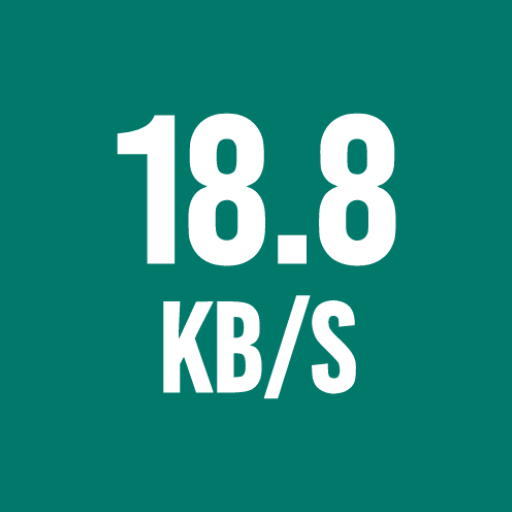
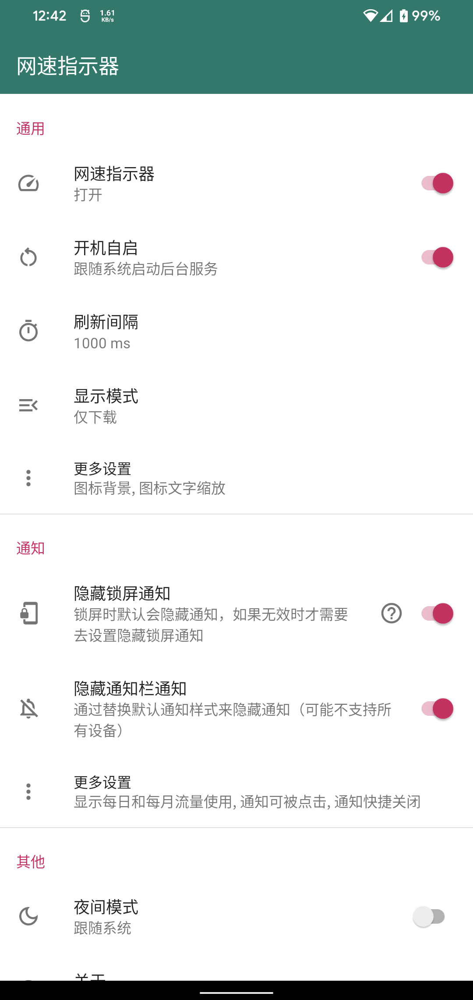
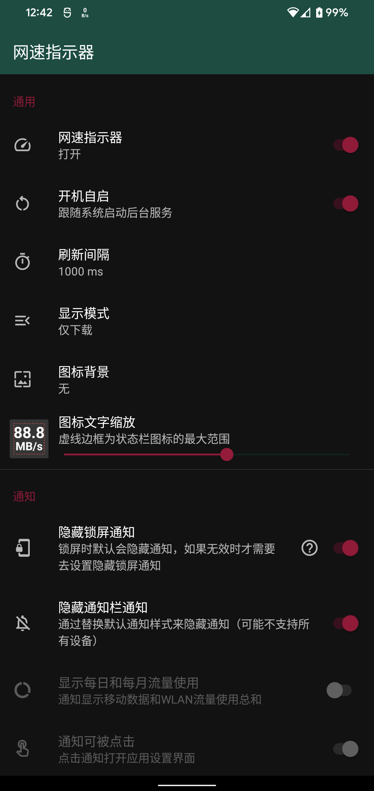
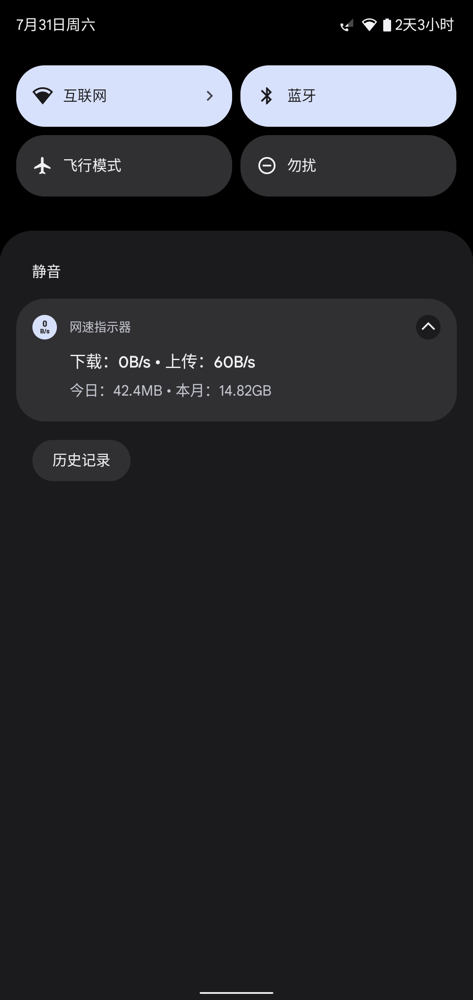
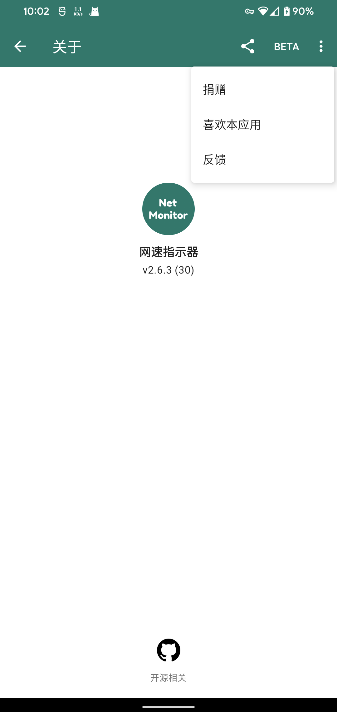

# 网速指示器

一个在系统状态栏显示当前网速的App，并在通知栏显示详细数据，主要针对原生ROM。

自用网速指示器，支持6.0及以上系统，兼容Android 12，支持中英文。

* 支持通知栏Tile（7.0+）
* 支持今日和当月流量使用显示
* 支持系统夜间模式
* 支持图标简单自定义

通过系统通知的SmallIcon实现，显示范围受系统状态栏图标大小限制，不同设备显示大小可能不相同，但是会尽最大限度来保证显示完整且确保精度。

如果你有什么好的想法请提交 [**Issues**](https://github.com/hushenghao/NativeTools/issues) 或 [**Pull requests**](https://github.com/hushenghao/NativeTools/pulls)

[无法隐藏锁屏通知？](./docs/hide_lock_notification.md)

## 应用截图

  
 

## 应用下载

## 联系我
Email：dede.hu@qq.com

## 捐赠
 