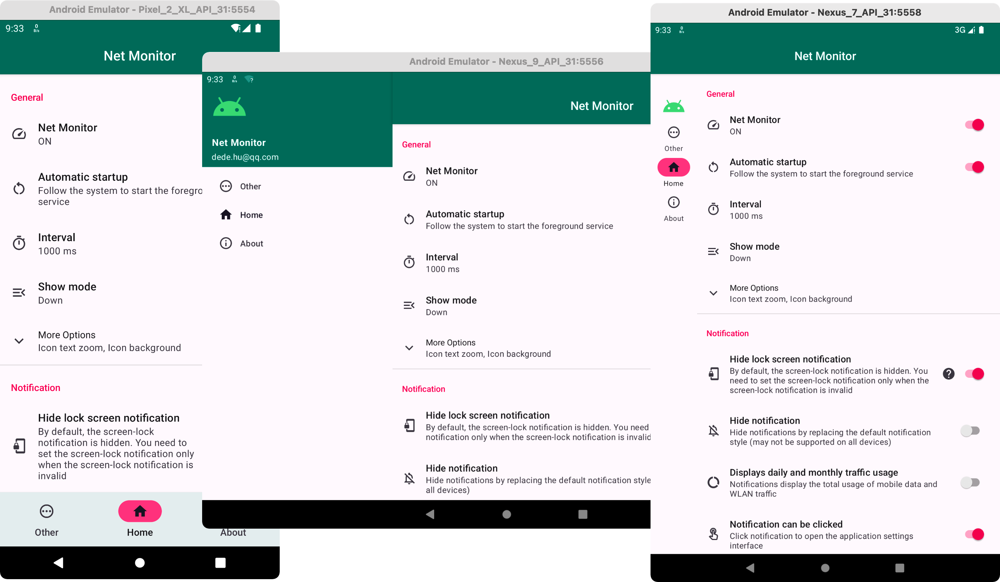

# 网速指示器

一个在系统状态栏显示当前网速的App，并在通知栏显示详细数据，主要针对原生ROM。

自用网速指示器，支持6.0及以上系统，兼容Android 13，支持中英文。

* 支持通知栏Tile（7.0+）
* 支持今日和当月流量使用显示
* 支持系统夜间模式
* 支持图标简单自定义

通过系统通知的SmallIcon实现，显示范围受系统状态栏图标大小限制，不同设备显示大小可能不相同，但是会尽最大限度来保证显示完整且确保精度。

如果你有什么好的想法请提交 [**Issues**](https://github.com/hushenghao/NativeTools/issues) 或 [**Pull requests**](https://github.com/hushenghao/NativeTools/pulls)

[无法隐藏锁屏通知？](https://github.com/hushenghao/NativeTools/wiki/Hide-lock-screen-notification)

[为什么删除了隐藏通知功能？](https://developer.android.google.cn/about/versions/12/behavior-changes-12#custom-notifications)

## 应用截图

## 应用下载

## 感谢
[Татьяна Юрина](mailto:urinatatana57@gmail.com) 提供的俄语翻译

## 联系我
Email：[dede.hu@qq.com](mailto:dede.hu@qq.com)

## 捐赠

[捐赠记录](apis/donate_list.json)

如果**没有找到您的捐赠记录**，请发送送邮件联系我
