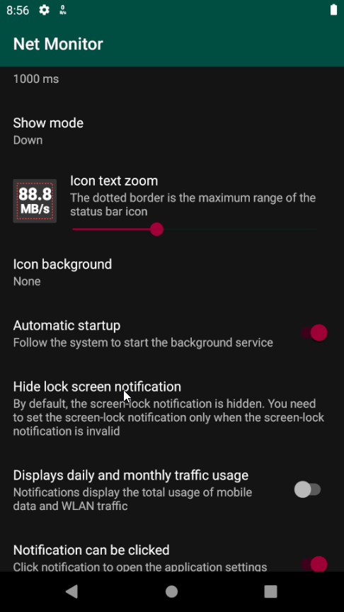
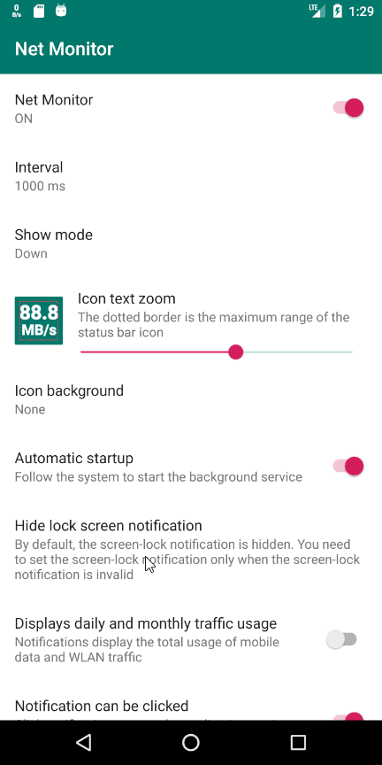

# Hide lock screen notification

Does this document tell you how to modify the Settings to hide the "Net Monitor" lock screen notification.

## On Android O above

Above Android O, you can set the display status of each notification on the lock screen separately.

### Lock screen password enabled (recommend)

When a lock screen password is set (except for swipe unlock), a separate notification setting can be used to hide the lock screen notification.

### Lock screen password disable

Use global lock screen Settings to hide lock screen notifications.

---

## Under the Android O

Use global lock screen Settings to hide lock screen notifications.

